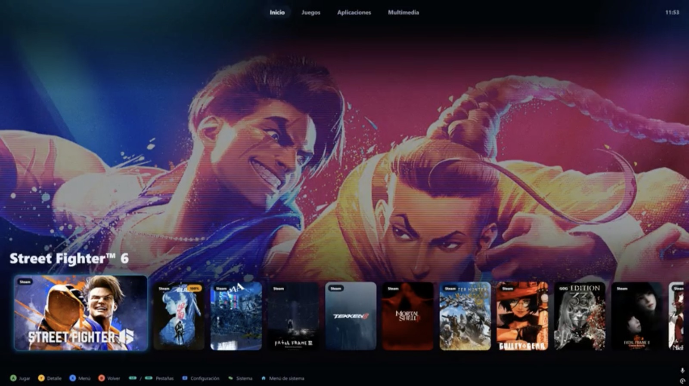
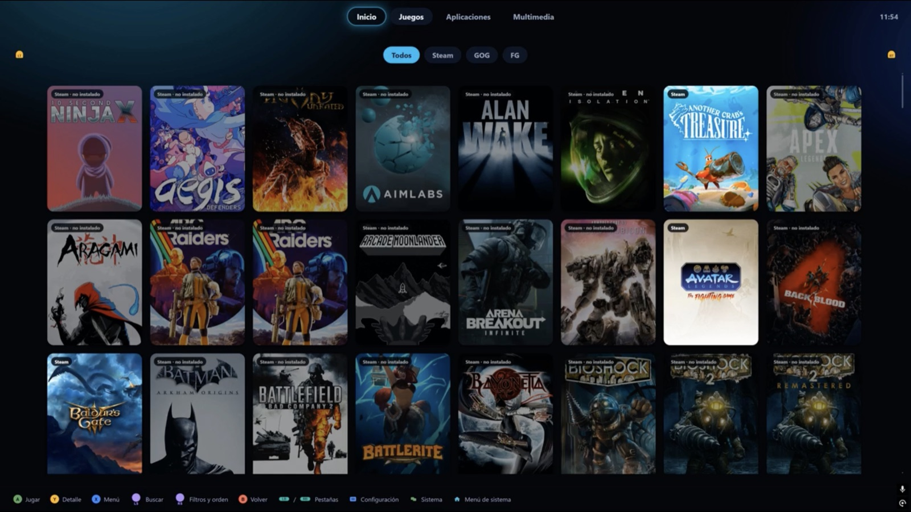
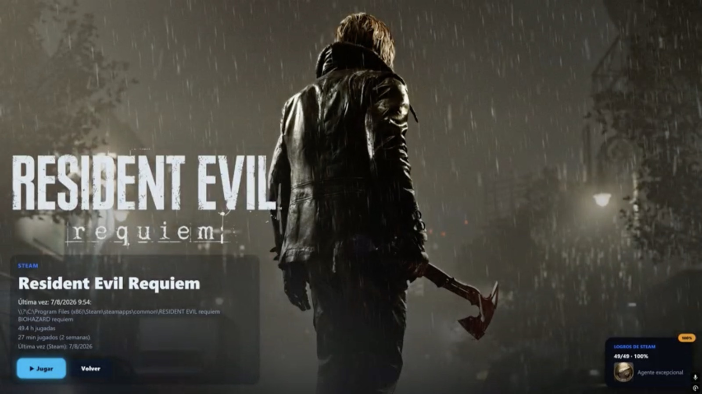
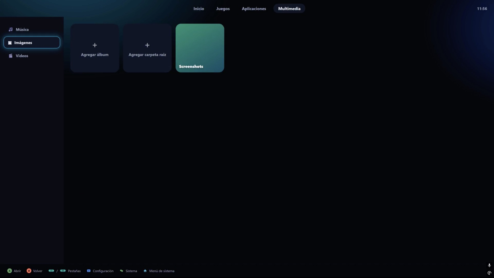

<p align="center">
  
</p>

<h1 align="center">VELUM</h1>

<p align="center">
  Launcher de sala tipo consola para PC — buscamos generar una experiencia en PC alternativa a Steam en modo Big Picture y el modo X Box de windows manejable con mando, con un aspecto customizable por CSS y el uso de perfiles, más sin embargo no representar una barrera de entrada enorme a los usuarios poco experimentados.
</p>

<p align="center">
  
  
  
  
</p>

<!--
  Cuando el repo tenga URL pública, sumar acá badges que dependen de ella, p. ej.:
  - Última versión: https://img.shields.io/github/v/release/<owner>/<repo>
  - Descargas: https://img.shields.io/github/downloads/<owner>/<repo>/total
-->

## Overview

VELUM convierte una PC (alcance actual para Windows) en una experiencia tipo consola para la
sala/salón: arranca a pantalla completa, muestra la biblioteca de juegos instalados y
Nuestro objetivo es lograr una experiencia **100% con mando** — reduciendo drásticamente el uso de mouse y teclado, sin salir a Windows.
Una de las principales características es el aspecto, se busca que sea completa y fácilmente **editable**: no hay
colores/medidas fijas en la interfaz y a la mano de cualquier usuario ya que el diseño fue pensado para mantener
temas y perfiles para adaptarse a múltiples configuraciones de interfaz, esto otorga completa capacidad al usuario
de mantener una interfaz que pueda sentir propia y a su gusto sin tocar código ni integrar programas externos complejos.

Pensado para **consumir el mínimo de recursos mientras se juega** — el launcher se
suspende al lanzar un juego y se restaura solo al volver o al usar un comando configurable desde el control.

## Features

- **Biblioteca unificada**: juegos y apps de Steam/GOG/Epic/Ubisoft Connect/EA Play detectados localmente,
  con vinculación opcional de cuenta de Steam (biblioteca propia completa, incluyendo lo no
  instalado y logros).
- **Multimedia personal**: Música (álbumes, discos multi-CD, listas de reproducción),
  Imágenes (visor) y Videos (streaming real del video en local, sin cargar el archivo entero a memoria).
- **Temas y perfiles**: aspecto 100% personalizable por tokens CSS — incluye el tema
  de marca **Velum** con 3 variantes (oscuro, claro, y una variante "Pulse") además de otros temas configurables.
- **100% mando**: navegación completa, el software integrará menú rápido de sistema y menú radial
  (mantener Home por defecto con capacidad de configuración) para atajos de un solo gesto.
- **Configuración inicial**: primer arranque guiado (selección de tiendas a mostrar, posteriormente se integrará la configuración de idioma, región de Steam y futuras plataformas, además de la misma vinculación de las plataformas).
- **Autoarranque con Windows** — deja la PC lista para iniciar a jugar.
- **Teclado virtual en pantalla** y **sonidos personalizables** (navegación,
  notificaciones, inicio).

## Capturas

<table>
  <tr>
    <td><br/><sub>Inicio</sub></td>
    <td><br/><sub>Biblioteca</sub></td>
  </tr>
  <tr>
    <td><br/><sub>Detalle de juegos</sub></td>
    <td><br/><sub>Multimedia</sub></td>
  </tr>
</table>

## Instalación

### Para jugar (usuario final)

1. Bajá el instalador (`.exe`/`.msi`) más reciente desde
   **[Releases](https://github.com/LaloSoftware/project-velum/releases)**.
2. Ejecutalo — Windows 10/11 con WebView2 (ya viene instalado en versiones modernas de
   Windows) es el único requisito.
3. Listo — VELUM arranca a pantalla completa.

### Para desarrollo

Requisitos: **Node.js** y **Rust** (rustup).

```bash
npm run go
```

Un solo comando: instala las dependencias que falten y levanta la app nativa (sirve
tanto en macOS para desarrollar como en Windows).

Otros atajos útiles: `npm run setup` (deja la máquina lista sin levantar la app),
`npm run web` (solo la UI en el navegador, con datos simulados), `npm run dist`
(compila el instalador), `npm run bundle` (empaqueta el repo para llevarlo a otra
máquina).

## Información de desarrollo

- **Stack**: [Tauri v2](https://tauri.app/) (backend Rust + WebView del sistema,
  footprint mínimo), [Svelte 5](https://svelte.dev/) + Vite (frontend), `gilrs`
  (lectura de mando en Rust — Xbox/XInput, DualSense, genéricos).
- **Arquitectura**: el frontend habla con Rust únicamente a través de una capa de
  IPC — en modo navegador (sin Tauri) esa misma capa cae a datos simulados, así que
  la UI se puede desarrollar y probar sin el backend nativo. Lo específico del SO
  (fuentes de biblioteca, controles de sistema) vive detrás de traits con una
  implementación simulada activa en macOS y la real en Windows, para que el
  desarrollo en Mac no dependa de tener Windows a mano.
- **Theming**: todo el aspecto se expresa con variables CSS (`--gm-*`) — un tema o
  perfil es un conjunto de overrides de esas variables más CSS opcional. Cambiar el
  aspecto nunca requiere tocar un componente (funcionalidad en desarrollo).
- **Mapa de carpetas** (alto nivel):
  ```
  src/                 Frontend (Svelte)
    lib/components/      Vistas y widgets
    lib/stores/          Estado de la app
    lib/theming/         Temas y tokens de diseño
    lib/input/           Navegación por foco + fuentes de input (mando/teclado)
    lib/ipc/             Frontera con el backend
  src-tauri/            Backend (Rust / Tauri)
  ```

## Roadmap

- **Internacionalización** (trabajo en proceso): selector de idioma/región para la interfaz (hoy 100% en
  español con opción de menúes en inglés) y para las preferencias regionales de Steam.
- Soporte de Steam Controller y otros controles por medios inalámbricos.
- Controles de sistema reales de Windows (Wi-Fi/Bluetooth/volumen) en el menú rápido.
- Selección de pantalla de salida (multi-monitor / TV).
- `GOG integrado` para vinculación de la biblioteca
- `EpicSource` biblioteca de Epic Games

## Contribución

Los issues y pull requests son bienvenidos. El desarrollo activo vive en la rama
`dev` — las ramas de trabajo (`feature/*`, `testing/*`) se mergean ahí antes de
llegar a `release`.

## Licencia

VELUM se distribuye bajo una **licencia personalizada** (no es una licencia OSI
estándar) — texto completo en [`LICENSE`](./LICENSE).

> ⚠️ **Borrador**: la licencia está actualmente en revisión y puede modificarse antes
> de considerarse definitiva.

## Atribuciones

Construido sobre [Tauri](https://tauri.app/), [Svelte](https://svelte.dev/) y
[`gilrs`](https://gitlab.com/gilrs-project/gilrs), entre otras dependencias de
código abierto.

Todo el audio actualmente incluido en la aplicación (`src/assets/sounds/`) fue
grabado por Eduardo Lemus Laguna. Cualquier audio que se agregue a futuro será
igualmente generado por el autor, salvo que se indique explícitamente lo contrario
para algún asset puntual.

## Disclaimer

VELUM es un proyecto independiente y no oficial. No está afiliado, respaldado ni
patrocinado por Valve Corporation (Steam), GOG sp. z o.o., Epic Games ni Electronic
Arts. Todas las marcas mencionadas son propiedad de sus respectivos dueños.
